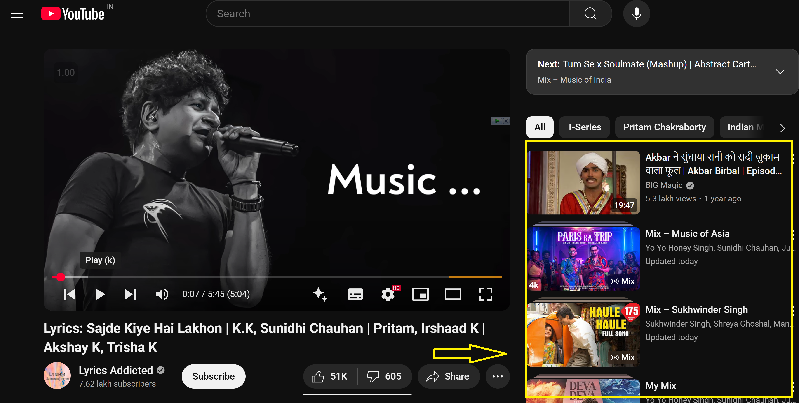

# YouTube Crappy Videos Remover

A userscript that removes YouTube videos with fewer than 999 views from recommendations, watch pages, and Shorts, enhancing your YouTube browsing experience.

## Installation
1. Install [Tampermonkey](https://www.tampermonkey.net/) for Chrome, Firefox, or Safari.
2. Click [here](https://raw.githubusercontent.com/GauravScripts/YouTube-Crappy-Videos-Remover/main/YouTubeCrappyVideosRemover.user.js) to install the script.
3. Tampermonkey will prompt you to install; click "Install."

## Features
- Removes videos with fewer than 999 views from recommendations.
- Automatically skips low-view YouTube Shorts.
- Supports main feed, watch pages, related videos, and comments section.
- Excludes subscriptions and channel pages to preserve your preferred content.
- Handles modern YouTube layouts, including `yt-lockup-view-model`.

## Screenshots
### Before Filtering
### After Filtering

## Contributing
Found a bug or have a feature request? Open an issue [here](https://github.com/GauravScripts/YouTube-Crappy-Videos-Remover/issues). Pull requests are welcome!

## License
[MIT License](LICENSE)